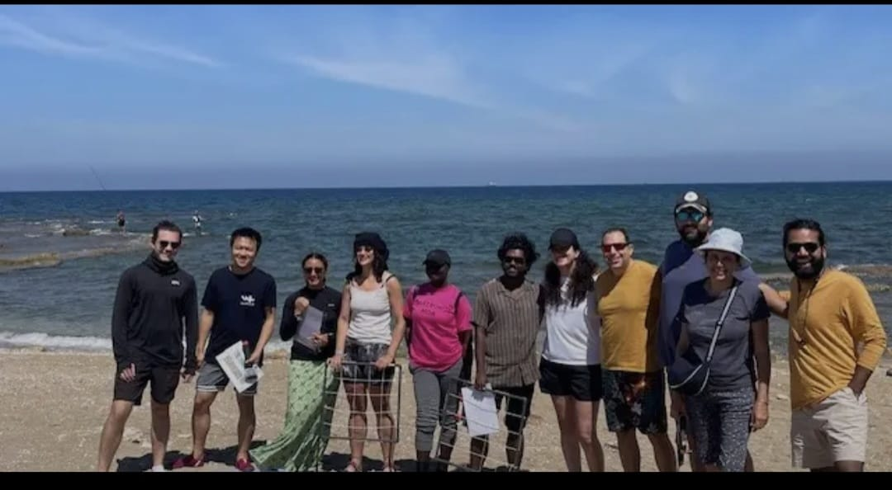
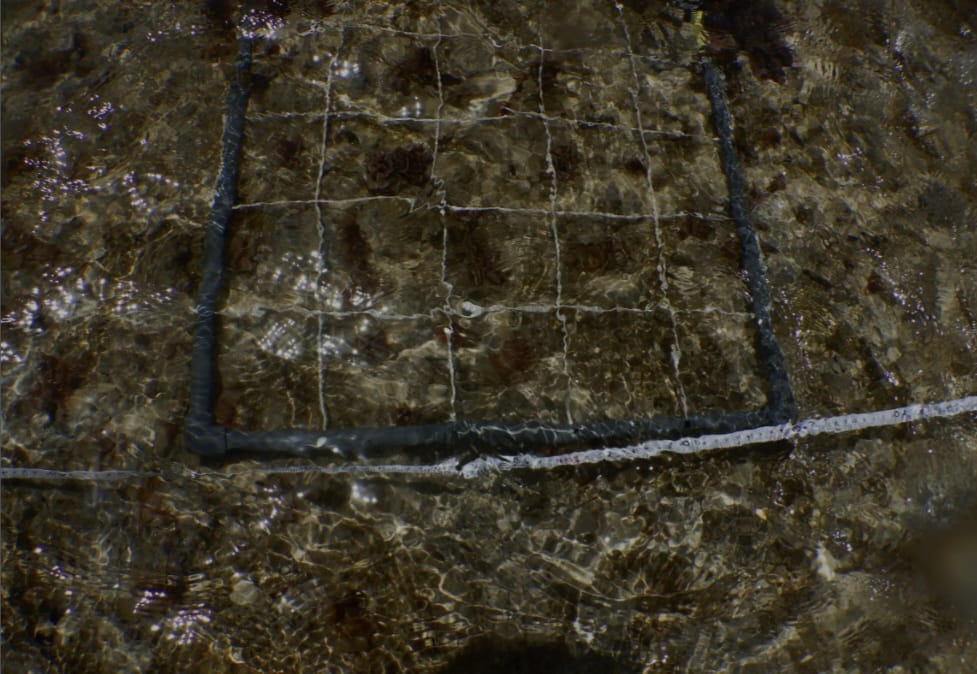
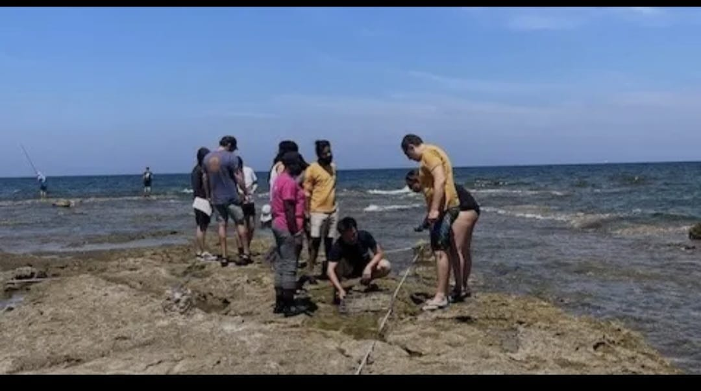
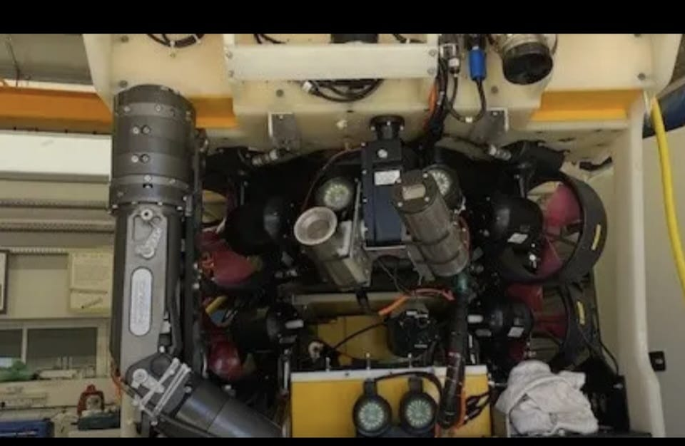
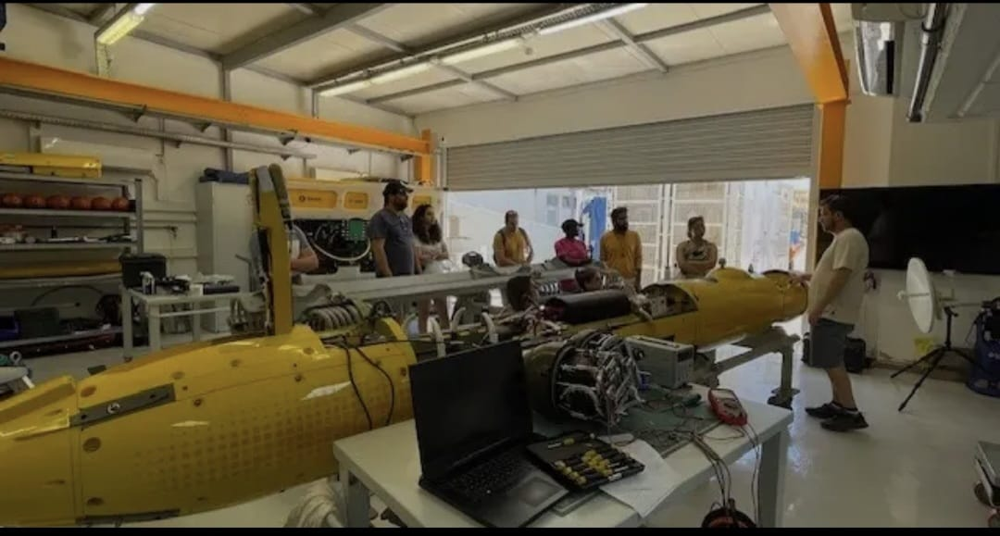

# Hands-On Learning: Marine Research Methods at Israel Oceanographic and Limnologiacal Research Institute (IOLR)

## Arrival and preparation talk at (IOLR)

-We undertook the field trip to the IOLR as part of the research methods led by Dr. Tal Luzzatto Knaan on 8th of May 2025, the field activity was joined by assistant Prashant Twari, Perrik Harania and Dr. Maxim Robin-Blum. The participants of the course arrived either individually or in groups. Upon arrival, We first attended the Lecture conducted by Dr Tal for some minutes. We then proceed to Shikmona on the shore of Mediterranian Sea at IOLR where we received an explanation of the activities planned for the day. The figures below included identifying various marine intertidal organisms, mainly algae,Ulva,snails, crude oil, Ulva, Barnicole,stones, small fish the fingerlines etc, to a depth of two meters and above (optional) and how to collect marine sample.

[Receiving overview of the field activities]

## Identificatication of Marine Intertidal Organism and Counting of water different Organism species

The sea was slightly calm that day and walking on the intertidal was an exciting an exciting experience that facilitated the identification of the intertidal organism species that is algae and other species organism in the water. We were provided with a list of algae species photographs to help us in correctly identification. We gained hands-on experience in quantifying the coverage of algae and other species  within a specified area. We used transects (tape measure) and quadrats for this task. We laid a 25- Meter transect line and placed quadrats every 5- Meter to count the number of algae and other species present within each location(Figure Below). We laid three transect lines and counted the algae and other species present; the results are shown in Table A, B & C.

[Counting Algae with other species within a specified area by placing quadrants] 

[Actual counting practical using quadrat and transect line] 

Tables Below : intertidal organism and different water organisms species counts along three transect lines on the intertidal shore

## A

|   Distance (M) |   wet stones |   Green algae |   ulva |   barnicoles |
|---------------:|-------------:|--------------:|-------:|-------------:|
|              5 |           25 |             0 |      0 |            0 |
|             10 |           25 |             9 |      0 |            4 |
|             15 |            4 |             0 |      0 |            0 |
|             20 |            3 |             3 |      3 |            0 |
|             25 |            2 |             0 |      0 |            0 |

## B

| Distance (M) | Wet stones | Green algae  | White algae  | Classifying algae  | ulva | Dry stones  |
|--------------|------------|--------------|--------------|--------------------|------|-------------|
| 5            | 25         | 0            | 0            | 1                  | 0    | 0           |
| 10           | 0          | 22           | 6            | 1                  | 0    | 0           |
| 15           | 22         | 0            | 0            | 0                  | 0    | 25          |
| 20           | 0          | 0            | 0            | 0                  | 1    | 0           |
| 25           | 0          | 0            | 0            | 0                  | 18   | 0           |

## C

| Distance (M) | Snail | Fish | Stones | Brown algae | Crude oil | White algae | Ulva | shushana |
|--------------|-------|------|--------|-------------|-----------|-------------|------|----------|
| 5            | 0     | 0    | 25     | 0           | 0         | 0           | 0    | 0        |
| 10           | 0     | 1    | 0      | 17          | 0         | 0           | 0    | 0        |
| 15           | 0     | 0    | 0      | 0           | 2         | 0           | 0    | 0        |
| 20           | 0     | 0    | 0      | 2           | 0         | 2           | 7    | 0        |
| 25           | 1     | 3    | 1      | 0           | 0         | 0           | 0    | 5        |

## Exploring the Sea measurement from surface to depth

During the course, we learned how to explore the sea from surface to depth, using classsical and advanced research methods. We acquire practical knowledge of scientific research from formulating research questions and estimations, planning experinment to data collection and estimation, planing experinment to data collection and analysis, information sharing and scientific writing.

## Expoliring IOLR Marine Robot Technology

After done with our activies at the sea, we went back to IOLR, where Dr. Maxim Robin-Blum as through Marine Robot its pats and fuctions and how its used to colled data in the field that is inside the Sea. He told us the that robot work is good because it's used to make work easier in data collection, reduce human labor, reduce time consumind and also provide accurate data. he was abled to tought us on how to do experinment with a wide range of methods, beach field studies, research dieves, and gettin acquinted with advanced technologies such as In-Situ Nutrient Sensors. Marine Robot is Also Capable of exploring depth upto 3000 Meters Depth

[Marine Robot image1]

[Marine Robots part system]

[explorine marine robot part in general]

## Conclusion

In conlusion, after learning about marine roobot, we went to seminar room where Dr. Maxim took as through the final trip lecture slide presentation then we break for home. The trip was of importance because i was able to learned and expolere to knew things which I never knew before. Thanks to our Lecturers and TAs for organizing such a wonderfull and benefiting trip.