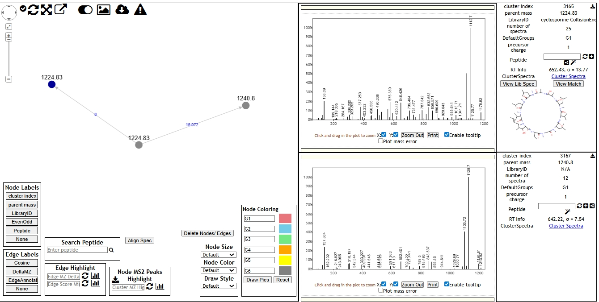

## Molecular Networking

Molecular networking is a computataional approach used in tandem mass spectromery (Ms/Ms) data analysis to 
organize and visualize the relationships between molecules based on their fragmentation patterns. It's
a powerful tool for exploring complex chemical spaces, especially in fields ike metabomics and natural product discovery.

 ### Generate a molecular networking according to the tutorial

 

 ### Exploring a molecular family including the neutral losses $ comparing two compounds and its figures
 
 ### Graph A

***Cluster Index***:3165
***Parent Mass***  :1224.83
***Library Id***   :Cyclosporine collision energy
***Spectra***     :25

### Graph B

***Cluster Index*** :3167
***Parent mass***   :1240.8
***Library Id***    :N/A
***Spectra***       :12

_Comparing the two spectra, there difference is 15.97Da mass difference, which indicates this activity to be loss of hydrogen, which is a common phenomenon in mass spectometry.

 ### Link to my tasks

 ***https://gnps.ucsd.edu/ProteoSAFe/result.jsp?view=network_displayer&componentindex=93&highlight_node=3165&task=06db08380dbd49df9de5da88ee155583#%7B%7D***

 ***https://gnps.ucsd.edu/ProteoSAFe/status.jsp?task=06db08380dbd49df9de5da88ee155583***