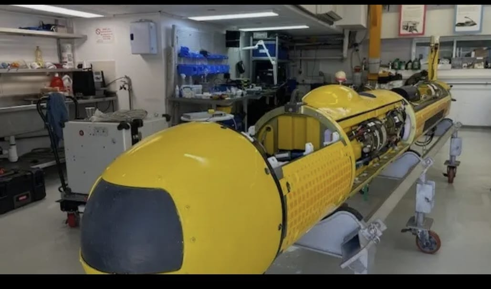

# Lionfish Dissection Protocal

## Equipment and Materials                                                                                                         

-Dissection tray 
-Gloves
-Scarpel
-Forceps
-Measuring tape
-Notebook
-Preservation jar

<u>Note:</> All tools must be sterlized before and after use.

## Step-by-step procedure

### ***1. preparation of the work area***

-Ensure the dissection station is clean and that all instrument are laid out on a sterile tray. Wear glovesand protective goggles.

### ***2. Measurement and Recording***

-Measure the total length and weight of the lionfish specimen using a measuring tape and digital scale.
-Record the data on the table below

### ***3. External Examination***

-Inspect the specimen's fins, spines, and skin for lesions, parasites or abnomalities.
-Use forceps to gently extend the pectoral fins for observation.

### ***4. Internal Dissection***

-Use a scapel to make an incision along the vental side from the anal fin to the gills.
-Carefully open the body cavity to expose internal organs.
     -Remove the digestive tract for further examination 
     -Extract the  stomach and inspect for pray items 
                                                                                            
### ***5. Presesrvation***

-Place dissected parts into labeled jars containing 10% formalin solution for storage.

## Photos

)
*Figure 1: Prepared lionfish on dissection tray with labeled tools.*

)
*Figure 2: Lionfish internal organs after midline incision.*

## Data Table

 Date       | Specimen ID | Length (cm) | Weight (g) | Stomach Content | Notes           |
|------------|-------------|-------------|------------|------------------|------------------|
| 2025-04-20 | LION-001    | 24          | 550        | Crustaceans      | Normal health    |
| 2025-04-21 | LION-002    | 27          | 620        | Small fish       | Signs of trauma  |
| 2025-04-22 | LION-003    | 21          | 510        | Empty            | Dehydrated skin  |
| 2025-04-23 | LION-004    | 26          | 580        | Shrimp + crab    | Healthy coloring |
| 2025-04-24 | LION-005    | 23          | 540        | Amphipods        | Slight bruising  |
| 2025-04-25 | LION-006    | 25          | 560        | Small fish       | Normal health    |

## Scientific Reference

- [Lionfish Dissection Techniques](hhtps://researchgate.net/publication/345678912-Lionfish-Dissection-Techniques)

## **Online Protocal
- [Trizol Reagent Procedure](https://www.thermofisher.com/order/catalog/product/15596026)

## Graph

! [Lionfish Lengths Over Time]()
*Figure 3: Varition in lionfish length across sampled date.*

                                                                                                                                         